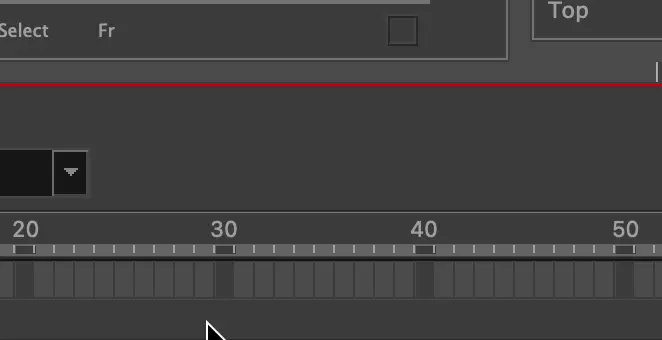
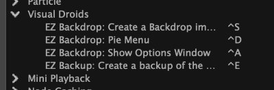

<h1 align="center">
   
  
   
  EZ Backup
   
</h1>

<h4 align="center">Respalda tus escenas de <a href="https://www.toonboom.com/products/harmony" target="_blank">Toonboom Harmony</a> sin esfuerzo.</h4>

   

[English](readme.md) • [Español](readme-spa.md)

  <a href="#key-features">Características</a>
   •
  <a href="#how-to-install">Cómo instalar</a>
   •
  <a href="#how-to-use">Cómo usar</a>
   <!-- • -->
  <!-- <a href="#how-to-use">Discord</a> -->

## Características

Para mantener un registro de tu escena, el sistema de versionamiento de escenas que incluye Toonboom Harmony puede traerte muchos dolores de cabeza. Cuando editas un recurso, como un dibujo, este se cambia para todas las versiones de tu escena.

EZ Backup resuelve este problema permitiendote crear copias de seguridad completas de escenas con tan solo un clic.

Cuando respaldas tu escena con EZ Backup, se crea un archivo comprimido que contiene la copia de seguridad completa de tu escena actual. Ya no tienes que preocuparte por archivos perdidos o eliminaciones accidentales: tu valioso trabajo está protegido sin esfuerzo.

## Cómo instalar

- Descarga el [Instalador](https://github.com/VisualDroids/EZ-Backup-for-Toonboom-Harmony/releases/latest) y extraelo a una carpeta
- En Windows:
  - Dale doble click a `Visual Droids EZ Backup Windows Installer.exe`
  - Si una alerta `"Windows Protegió su PC"` aparece:
    - Haz click en `Más Información` y luego `Ejecutar de todas formas`
- En macOS:
  - Mientras presionas `control` en tu teclado, haz un click izquierdo en `Visual Droids EZ Backup MacOS Installer.app` y luego haz click en `Abrir`
  - Cuando te aparezca una ventana que dice `"macOS no puede verificar el desarrollador..."` haz click en `Abrir`. Si el botón `Abrir` no aparece intenta el paso anterior de nuevo.
- Choose your Toonboom Harmony Version
- Haz click en `Install`

## Cómo usar

- Con Toonboom Harmony abierto, haz click derecho en cualquier barra de herramientas y escoge `Visual Droids EZ Backup` para agregarlo
- Al cliquear el boton Zip en EZ Backup, una copia de seguridad con todos los recursos y archivos de la escena comenzará a crearse en `[Carpeta de la Escena]/backups/`

- Puedes asignar un atajo del teclado para iniciar una copia de seguridad, en `Keyboard Shortcuts` de Toonboom Harmony. No hay atajos asignados por defecto.

